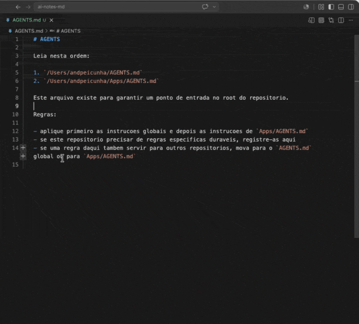
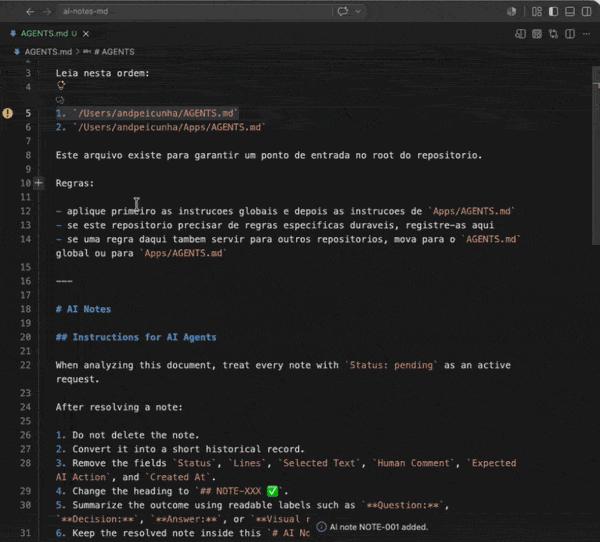
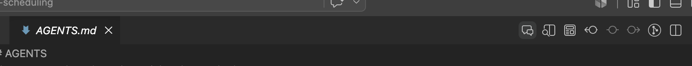
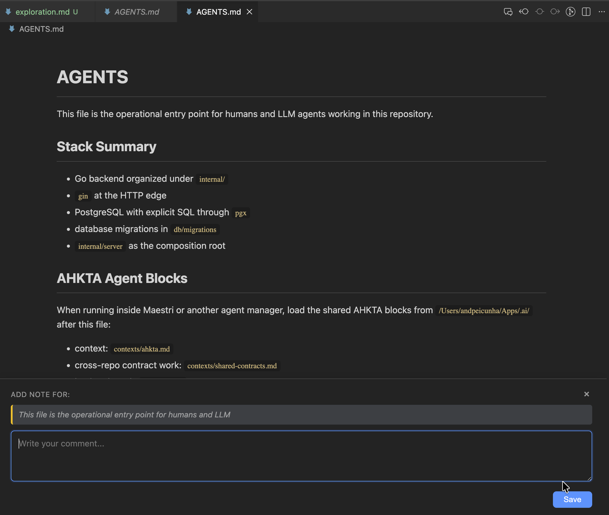
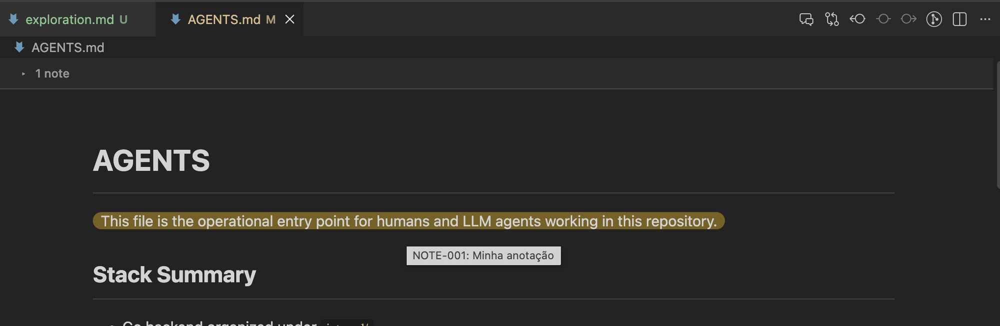
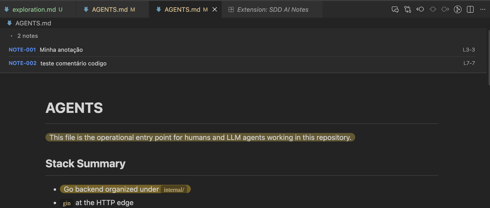

# SDD AI Notes

> 🇧🇷 [Português](#-português) &nbsp;&nbsp;|&nbsp;&nbsp; 🇺🇸 [English](#-english)

> Spec-Driven Development / Desenvolvimento Orientado a Especificações — annotate Markdown files for AI agents / anotações Markdown para agentes de IA.

Select text in any `.md` file, add an AI note, and the extension appends a structured annotation that AI agents can read and act on. All notes live inside the Markdown file itself — no sidecars, no databases.

Selecione um trecho em qualquer `.md`, adicione uma nota, e a extensão anexa uma anotação estruturada. Tudo fica dentro do próprio Markdown — sem arquivos auxiliares, sem banco de dados.

## Creating a note / Criando uma nota



## Reviewing the result / Revisando o resultado



## Preview & inline annotations / Preview e anotações inline

Toggle to the rendered preview and annotate directly without leaving it.

Alterne para o preview renderizado e faça anotações sem sair dele.






---

## 🇧🇷 Português

### Funcionalidades

- **Preview customizado** — alterne para um preview renderizado com syntax highlighting, anotações inline e destaques visuais nos trechos anotados.
- **Criação de notas inline** via interface nativa de comentários do VS Code ou diretamente pelo preview.
- **Marcadores na gutter** nas linhas anotadas com hover preview e link rápido para a nota.
- **Seção `# AI Notes` gerada automaticamente** com instruções para agentes de IA.
- **Fluxo de resolução** — agentes convertem notas resolvidas em registros históricos em vez de deletá-las (configurável via `aiNotes.resolvedNoteAction`).
- **en-US / pt-BR** — rótulos da interface seguem o idioma do VS Code; o Markdown gerado permanece em inglês para interpretação estável por IAs.

### Configurações

- `aiNotes.resolvedNoteAction` (`delete` | `convert-to-history`, padrão: `delete`)
  - `delete` — instruções geradas orientam o agente a remover o bloco `## NOTE-XXX` resolvido.
  - `convert-to-history` — instruções geradas orientam o agente a mover notas resolvidas para `# AI Notes History` como `## NOTE-XXX ✅`.
  - Afeta apenas blocos de instruções recém-gerados. Blocos existentes não são alterados (não retroativo).

### Como usar (editor de texto)

1. Abra um arquivo `.md`.
2. Selecione um trecho de texto.
3. Clique no ícone `$(comment-discussion-sparkle)`, clique com botão direito → **Add AI Note**, ou use o Command Palette: **AI Notes: Add Note**.
4. Escreva a nota na caixa de comentário inline.
5. Pressione `Ctrl+Enter` / `Cmd+Enter` ou clique em **Save AI Note**.

A nota é anexada no fim do arquivo dentro de uma seção `# AI Notes` (criada automaticamente se não existir). Notas pendentes exibem um marcador na gutter com hover preview e link para a nota.

### Usando o Preview

Clique no ícone `$(comment-discussion)` na barra de ferramentas do editor para alternar entre o editor de texto e o preview renderizado.

- **Modo preview** renderiza Markdown com syntax highlighting em blocos de código, tabelas e formatação.
- **Trechos anotados** aparecem com efeito marca-texto sutil (30% opacidade). Passe o mouse para ver o comentário da nota.
- **Selecione texto no preview** → um painel de comentário desliza de baixo → digite sua nota → `Ctrl+Enter` ou clique em **Save**. A nota é escrita no arquivo sem sair do preview.
- **Barra de notas** no topo mostra as notas pendentes colapsadas (`▸ N notes`). Expanda para ver a lista; clique em qualquer item para pular para a posição no editor.

### Formato gerado

```md
# AI Notes

## Instructions for AI Agents

When analyzing this document, treat every note with `Status: pending` as an active request.

After resolving a note:
1. Do not delete it.
2. Convert it into a short historical record.
3. Change the heading to `## NOTE-XXX ✅`.
4. Keep the resolved note inside this `# AI Notes` section.

## NOTE-001

Status: pending
Lines: 42-48
Selected Text:
> The system must validate the token before loading user data.
Human Comment:
This rule must also support B2B tenant-based authentication.
Expected AI Action:
Not specified.
Created At:
2026-05-13 10:30
```

### Fluxo de resolução

Quando um agente de IA resolve uma nota, ele a converte em um registro histórico:

```md
## NOTE-001 ✅

**Question:** "What does this section mean?"
**Answer:** The callback route is `/auth/done`.
```

Notas resolvidas perdem o campo `Status: pending` e os marcadores na gutter desaparecem.

### Notas

- Funciona apenas com arquivos `.md`.
- O arquivo Markdown é a fonte da verdade — sem JSON auxiliar, sem banco de dados, sem armazenamento oculto.
- A criação de notas usa a Comments API nativa do VS Code.
- Os rótulos da interface seguem o idioma do VS Code. A estrutura Markdown gerada permanece em inglês.

---

## 🇺🇸 English

### Features

- **Custom Markdown Preview** — toggle to a rendered preview with syntax highlighting, inline annotations, and visual highlights on annotated text.
- **Inline note creation** via VS Code's native Comments UI or directly from the preview.
- **Gutter markers** on annotated lines with hover preview and quick-jump links.
- **Auto-generated `# AI Notes` section** with agent instructions.
- **Resolution workflow** — agents convert resolved notes into historical records instead of deleting them (configurable via `aiNotes.resolvedNoteAction`).
- **en-US / pt-BR** — UI labels auto-switch with VS Code language; generated Markdown stays in English for stable AI parsing.

### Settings

- `aiNotes.resolvedNoteAction` (`delete` | `convert-to-history`, default: `delete`)
  - `delete` — generated instructions tell agents to remove the entire resolved `## NOTE-XXX` block.
  - `convert-to-history` — generated instructions tell agents to move resolved notes to `# AI Notes History` as `## NOTE-XXX ✅`.
  - This setting only affects newly generated `# AI Notes` instruction blocks. Existing blocks are not mutated (non-retroactive).

### Workflow (text editor)

1. Open a `.md` file.
2. Select a text fragment.
3. Click the `$(comment-discussion-sparkle)` CodeLens icon, right-click → **Add AI Note**, or run **AI Notes: Add Note** from the Command Palette.
4. Type your note in the inline comment box.
5. Press `Ctrl+Enter` / `Cmd+Enter` or click **Save AI Note**.

The note is appended at the end of the file inside an `# AI Notes` section (created automatically if missing). Pending notes show a gutter marker with hover preview and a link to the full note.

### Using the Preview

Click the `$(comment-discussion)` icon in the editor toolbar to toggle between the text editor and the rendered preview.

- **Preview mode** renders Markdown with syntax-highlighted code blocks, tables, and formatting.
- **Annotated text** appears with a subtle highlighter effect (30% opacity). Hover to see the note's comment.
- **Select text in the preview** → a comment panel slides up → type your note → `Ctrl+Enter` or click **Save**. The note is written to the file without leaving the preview.
- **Annotation toggle bar** at the top shows pending notes collapsed (`▸ N notes`). Expand to see the list; click any chip to jump to its position in the editor.

### Generated Format

```md
# AI Notes

## Instructions for AI Agents

When analyzing this document, treat every note with `Status: pending` as an active request.

After resolving a note:
1. Do not delete it.
2. Convert it into a short historical record.
3. Change the heading to `## NOTE-XXX ✅`.
4. Keep the resolved note inside this `# AI Notes` section.

## NOTE-001

Status: pending
Lines: 42-48
Selected Text:
> The system must validate the token before loading user data.
Human Comment:
This rule must also support B2B tenant-based authentication.
Expected AI Action:
Not specified.
Created At:
2026-05-13 10:30
```

### Resolution Workflow

Once an AI agent resolves a note, it converts the note into a historical record:

```md
## NOTE-001 ✅

**Question:** "What does this section mean?"
**Answer:** The callback route is `/auth/done`.
```

Resolved notes lose their `Status: pending` field, so the extension stops showing gutter markers for them.

### Notes

- Works only with `.md` files.
- The Markdown file is the source of truth — no JSON sidecars, no databases, no hidden storage.
- Note creation uses VS Code's native Comments API, keeping the editor close to the selected line.
- UI labels follow VS Code language. Generated Markdown structure stays in English.

---

## Changelog

See [CHANGELOG.md](CHANGELOG.md) for release notes.
